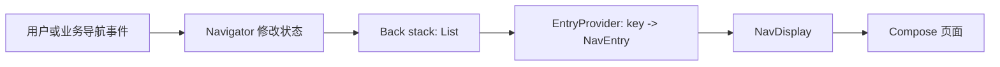
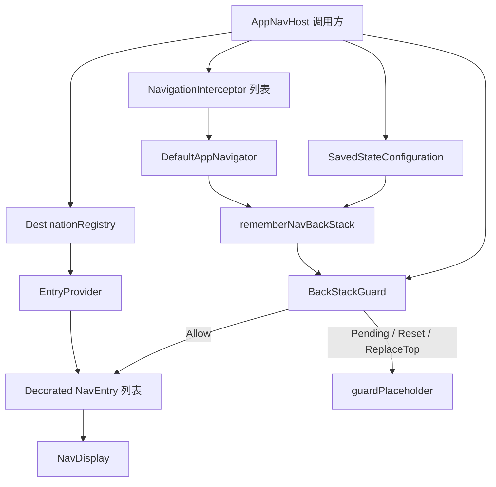
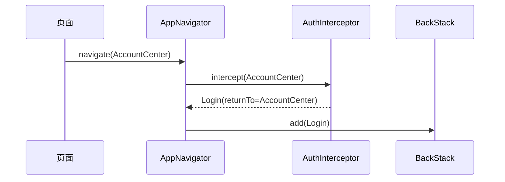

# Navigation 3 与 JdcrNavigation 设计和使用指南

本文面向第一次接触 Navigation 3 的开发者。目标不只是说明 API 怎么调用，还要解释：

- Navigation 3 如何理解“页面”和“导航”。
- 为什么 Navigation 3 强调由应用自己持有 back stack。
- `jdcrnavigation` 在原生 Navigation 3 之上增加了什么。
- 为什么导航拦截器不能代替恢复阶段的认证保护。
- `@Polymorphic`、`polymorphic(NavKey::class)` 和 `SavedStateConfiguration` 分别做什么。
- 为什么当前库需要这些依赖，以及为什么一些依赖应该是 `api`，另一些应该是 `implementation`。

建议第一次按顺序阅读第 1 至 11 章。以后遇到问题时，可以直接查阅第 12 至 16 章。

## 1. 先建立一个正确的 Navigation 3 心智模型

Navigation 3 的核心并不是 `NavController`，而是一个很简单的单向数据流：

1. back stack 保存“用户走过哪些页面”的状态。
2. 导航操作修改 back stack。
3. entry provider 把路由 key 转换成可显示的 `NavEntry`。
4. `NavDisplay` 观察 back stack，并显示对应的 entry。



最重要的一句话是：**Navigation 3 中，应用拥有 back stack；Navigation 3 负责把 back stack 映射成 UI。**

这和“调用一个框架方法，让框架内部偷偷切换页面”的思路不同。导航状态是应用状态的一部分，因此应用可以检查、保存、替换、测试和恢复它。

### 1.1 NavKey：页面的身份和参数

back stack 不直接保存 Composable，也不应该保存 `ViewModel`、Repository 或大型业务对象。它保存的是轻量、可比较、可序列化的 key。

```kotlin
@Serializable
data object Home : NavKey

@Serializable
data class ProductDetail(val productId: Long) : NavKey
```

`ProductDetail(1001)` 的含义是“当前要显示商品 1001 的详情”，而不是详情页 UI 本身。

路由参数应该满足这些原则：

- 只保存恢复页面所需的最小标识，例如 `id`、筛选条件或来源类型。
- 不保存 Repository、回调、Context、Bitmap 或完整数据库实体。
- 参数必须可以序列化，才能在配置变化或进程死亡后恢复。
- 同一个 key 的 `equals()` 结果会影响 `singleTop` 和 `popTo` 等行为。

### 1.2 Back stack：导航历史就是一个栈

假设当前 back stack 是：

```text
[Home, ProductList, ProductDetail(1001)]
```

最后一个元素是当前页面。

- 前进：在列表末尾添加 key。
- 返回：删除最后一个 key。
- 替换：删除最后一个 key，再添加新 key。
- 重置：清空列表，再添加一个根 key。

Navigation 3 的“push”和“pop”本质上就是对可观察列表的增删操作。

### 1.3 NavEntry：把 key 变成可显示内容

`NavEntry` 把一个 key 和对应的 Composable 内容关联起来。通常不需要手工创建它，而是使用 `entryProvider` DSL：

```kotlin
val provider = entryProvider<NavKey> {
    entry<Home> {
        HomeScreen()
    }

    entry<ProductDetail> { route ->
        ProductDetailScreen(productId = route.productId)
    }
}
```

这里的 `route` 就是 back stack 中的 `ProductDetail` 实例，因此页面参数不需要再从 Bundle 或字符串中解析。

### 1.4 NavDisplay：根据状态显示页面

原生 Navigation 3 的最小示例可以写成：

```kotlin
@Serializable
data object Home : NavKey

@Serializable
data class Detail(val id: Long) : NavKey

@Composable
fun MinimalNavigation() {
    val backStack = rememberNavBackStack(Home)

    NavDisplay(
        backStack = backStack,
        onBack = {
            if (backStack.size > 1) {
                backStack.removeAt(backStack.lastIndex)
            }
        },
        entryProvider = entryProvider {
            entry<Home> {
                HomeScreen(
                    onOpenDetail = { id -> backStack.add(Detail(id)) },
                )
            }

            entry<Detail> { route ->
                DetailScreen(route.id)
            }
        },
    )
}
```

`NavDisplay` 不决定“应该去哪里”。它只观察 back stack，并显示与顶部 key 对应的 entry。业务决策仍然属于应用。

## 2. 为什么项目不直接到处操作 back stack

直接调用 `backStack.add()` 可以工作，但大型项目中会逐渐出现这些问题：

- 每个页面重复实现 `singleTop`、替换、清栈等逻辑。
- 登录拦截可能只在部分入口执行。
- 非 Composable 层无法统一发起导航。
- 测试必须依赖具体的 Navigation 3 容器。
- 将来切换多 back stack 时，页面代码会大量修改。

因此 `jdcrnavigation` 引入了 `AppNavigator`：

```kotlin
interface AppNavigator {
    fun navigate(route: BaseAppRoute, singleTop: Boolean = true)
    fun back()
    fun replace(route: BaseAppRoute)
    fun resetTo(route: BaseAppRoute)
    fun popTo(route: BaseAppRoute, inclusive: Boolean = false)
}
```

它不是另一个 `NavController`，而是对“如何修改本应用导航状态”的集中定义。

这样设计有三个目的：

1. 页面表达意图，例如“去详情页”，而不是关心列表如何修改。
2. 拦截器只需要接入一个地方。
3. `AppNavigator` 是接口，页面预览和单元测试可以传入假实现。

## 3. 当前库的结构和职责

| 类型 | 职责 | 不负责什么 |
| --- | --- | --- |
| `BaseAppRoute` | 约束应用路由都属于同一套导航协议 | 不保存 UI 和业务对象 |
| `RequiresLogin` | 标记某个路由需要登录 | 不执行认证 |
| `AppNavigator` | 定义应用支持的导航操作 | 不显示页面 |
| `DefaultAppNavigator` | 修改 back stack，并在前进操作前执行拦截器 | 不持有登录状态 |
| `NavigationInterceptor` | 把目标路由转换成另一个目标路由 | 不检查已恢复的历史栈 |
| `AppNavHost` | 创建/恢复 back stack、安装 decorator、收集外部命令、执行 guard、显示页面 | 不定义具体业务页面 |
| `DestinationRegistry` | 让调用方集中注册路由与页面 | 不持有 back stack |
| `CommonPages` | 由 App 注入启动页和登录页 UI | 不实现启动和登录流程 |
| `SplashCoordinator` | 管理初始化异步状态 | 不定义启动页视觉 |
| `LoginMainCoordinator` | 管理登录异步状态 | 不定义登录页视觉 |
| `ExternalNavigationDispatcher` | 让非 Composable 入口发送导航命令 | 不代替业务事件系统 |

整体数据流如下：



## 4. 定义应用路由

建议每个业务模块拥有自己的路由类型，但所有路由最终实现 `BaseAppRoute`。

```kotlin
@Serializable
sealed interface AppRoute : BaseAppRoute {

    @Serializable
    data object Home : AppRoute

    @Serializable
    data class ArticleDetail(
        val articleId: Long,
    ) : AppRoute

    @Serializable
    data object AccountCenter : AppRoute, RequiresLogin
}
```

这里有三层含义：

- `@Serializable`：这个具体 key 可以被保存和恢复。
- `BaseAppRoute`：它可以交给 `AppNavigator`。
- `RequiresLogin`：导航到它之前需要经过认证策略。

不要把 `RequiresLogin` 理解成页面基类。它只是一个无状态标记，供 `AuthNavigationInterceptor` 和 `BackStackGuard` 判断策略。

## 5. 为什么需要多态序列化

### 5.1 问题来自静态类型和运行时类型不同

`rememberNavBackStack` 保存的是 `NavBackStack<NavKey>`。列表中的静态类型是 `NavKey`，运行时类型可能是：

```text
AppRoute.Home
AppRoute.ArticleDetail
CommonRoute.Splash
CommonRoute.Login
```

序列化器看到 `NavKey` 接口时，无法自动猜出运行时具体是哪一个类，也不知道如何恢复对应的 serializer。因此必须建立“基类到具体子类”的注册表。

### 5.2 `@Polymorphic` 做什么

当前登录路由中有：

```kotlin
@Serializable
data class Login(
    @Polymorphic
    val returnTo: NavKey? = null,
    val options: LoginOptions = LoginOptions(),
) : CommonRoute
```

`@Polymorphic` 标记的是一个**属性使用点**。它告诉 Kotlin Serialization：

> `returnTo` 的声明类型只是 `NavKey`，编码和解码时请根据实际运行时类型查找多态 serializer。

它不会自动注册任何子类。如果没有 `SerializersModule`，恢复时仍然会出现“serializer for subclass is not found”一类错误。

### 5.3 `polymorphic(NavKey::class)` 做什么

```kotlin
val appRouteSerializersModule = SerializersModule {
    include(commonRouteSerializersModule)

    polymorphic(NavKey::class) {
        subclass(AppRoute.Home::class, AppRoute.Home.serializer())
        subclass(
            AppRoute.ArticleDetail::class,
            AppRoute.ArticleDetail.serializer(),
        )
        subclass(
            AppRoute.AccountCenter::class,
            AppRoute.AccountCenter.serializer(),
        )
    }
}
```

`polymorphic(NavKey::class)` 建立的是**运行时类型注册表**：

```text
NavKey + AppRoute.Home              -> Home.serializer()
NavKey + AppRoute.ArticleDetail     -> ArticleDetail.serializer()
NavKey + AppRoute.AccountCenter     -> AccountCenter.serializer()
```

`commonRouteSerializersModule` 已经注册了库内的 `Splash` 和 `Login`，App 只需要 `include` 它，再注册自己的路由。

### 5.4 直接写 `polymorphic(BaseAppRoute::class)` 行不行

只在序列化位置的静态类型也是 `BaseAppRoute` 时才够用。当前设计中有两个关键位置的静态类型是 `NavKey`：

- back stack 是 `NavBackStack<NavKey>`。
- `Login.returnTo` 是 `NavKey?`。

因此只注册 `polymorphic(BaseAppRoute::class)` 不能满足当前恢复链路。当前架构应该统一注册到 `NavKey::class` 下。

如果未来把整个库改为 `NavBackStack<BaseAppRoute>`，并把 `returnTo` 改成 `BaseAppRoute?`，才可以统一改用 `BaseAppRoute::class`。这属于协议级变更，不能只改一行注册代码。

### 5.5 构造 SavedStateConfiguration

```kotlin
val navSavedStateConfiguration = SavedStateConfiguration {
    serializersModule = SerializersModule {
        include(commonRouteSerializersModule)

        polymorphic(NavKey::class) {
            subclass(AppRoute.Home::class, AppRoute.Home.serializer())
            subclass(
                AppRoute.ArticleDetail::class,
                AppRoute.ArticleDetail.serializer(),
            )
            subclass(
                AppRoute.AccountCenter::class,
                AppRoute.AccountCenter.serializer(),
            )
        }
    }
}
```

每增加一个可能进入 back stack 的具体路由，都要完成两件事：

1. 路由本身标记 `@Serializable`。
2. 在 `polymorphic(NavKey::class)` 中注册 serializer。

## 6. 注册页面并接入 AppNavHost

下面是一个完整的接入骨架。UI 代码只是示意，重点是各对象的创建位置和生命周期。

```kotlin
@Composable
fun AppRoot(
    authService: AuthService,
    initializer: SplashUiInitializer,
) {
    val externalDispatcher = remember {
        ExternalNavigationDispatcher()
    }
    val authInterceptor = remember(authService) {
        AuthNavigationInterceptor(authService) {
            LoginOptions(initialMethod = LoginMethod.Account)
        }
    }
    val sessionState by authService.sessionState.collectAsStateWithLifecycle()

    val commonPages = remember {
        CommonPages(
            splash = { state, onRetry ->
                AppSplashScreen(state = state, onRetry = onRetry)
            },
            login = { options, state, onLogin, onCancel ->
                AppLoginScreen(
                    initialMethod = options.initialMethod,
                    reason = options.reason,
                    state = state,
                    onLogin = onLogin,
                    onCancel = onCancel,
                )
            },
        )
    }

    AppNavHost(
        startRoute = CommonRoute.Splash,
        savedStateConfiguration = navSavedStateConfiguration,
        externalDispatcher = externalDispatcher,
        interceptors = listOf(authInterceptor),
        backStackGuard = { backStack ->
            evaluateBackStack(
                backStack = backStack,
                sessionState = sessionState,
            )
        },
        guardPlaceholder = {
            AppLoadingScreen()
        },
    ) { navigator ->
        installCommonPages(
            navigator = navigator,
            pages = commonPages,
            initializer = initializer,
            authService = authService,
            defaultAfterLogin = AppRoute.Home,
            onLoginCancel = {
                navigator.resetTo(AppRoute.Home)
            },
        )

        entry<AppRoute.Home> {
            HomeScreen(
                onOpenArticle = { articleId ->
                    navigator.navigate(AppRoute.ArticleDetail(articleId))
                },
                onOpenAccount = {
                    navigator.navigate(AppRoute.AccountCenter)
                },
            )
        }

        entry<AppRoute.ArticleDetail> { route ->
            ArticleDetailScreen(articleId = route.articleId)
        }

        entry<AppRoute.AccountCenter> {
            AccountCenterScreen()
        }
    }
}
```

`DestinationRegistry` 的 receiver 是 `EntryProviderScope<NavKey>`，参数是 `AppNavigator`。这样调用处可以同时使用：

- `entry<Route>` 注册页面。
- `navigator` 执行统一导航。
- `installCommonPages()` 安装库提供的公共流程。

### 6.1 使用类型安全的统一转场策略

当不同路由需要不同动画时，在 `AppNavHost` 调用处集中声明
`AppNavTransitionPolicy`。策略收到的是真实 `BaseAppRoute`，可以直接使用
Kotlin 类型判断，不要读取 `Scene.key` 或比较 `route.toString()`：

```kotlin
val transitionPolicy = remember {
    AppNavTransitionPolicy { fromRoute, toRoute ->
        when {
            fromRoute is CommonRoute.Splash || toRoute is CommonRoute.Splash ->
                AppNavAnimation.None

            fromRoute is CommonRoute.Login || toRoute is CommonRoute.Login ->
                AppNavAnimation.Fade()

            fromRoute is AppRoute.Home && toRoute is AppRoute.ArticleDetail ->
                AppNavAnimation.Slide(
                    forwardDirection = AppNavSlideDirection.Left,
                    durationMillis = 300,
                )

            else -> AppNavAnimation.Slide()
        }
    }
}

AppNavHost(
    // 其他参数省略
    transitionPolicy = transitionPolicy,
) { navigator ->
    // 注册页面
}
```

库提供三种可复用动画：

| 动画 | 行为 |
| --- | --- |
| `AppNavAnimation.Slide` | 前进时使用配置方向，普通返回和预测返回时自动反向 |
| `AppNavAnimation.Fade` | 分别配置进入和退出时长 |
| `AppNavAnimation.None` | 不执行转场动画，适合启动页切换等场景 |

`AppNavHost` 会在创建 `NavEntry` 时把真实 route 写入内部 metadata，因此该策略对
普通导航、返回以及进程恢复后继续导航都保持类型安全。动画选择的优先级为：

1. 页面通过 Navigation 3 metadata 显式提供的动画。
2. `transitionPolicy` 返回的统一动画。
3. `transitionSpec`、`popTransitionSpec` 和
   `predictivePopTransitionSpec` 提供的底层默认动画。

通常业务 App 只需要使用统一策略。只有 Compose 内置动画无法表达需求时，才直接配置
底层 transition spec。Compose 可能在同一次转场中多次求值策略，因此 `resolve` 应保持
无副作用，只根据输入 route 返回动画。

## 7. 导航操作的准确语义

假设当前 back stack 为：

```text
[Home, ArticleList, ArticleDetail(1)]
```

### 7.1 navigate

```kotlin
navigator.navigate(AppRoute.ArticleDetail(2))
```

结果：

```text
[Home, ArticleList, ArticleDetail(1), ArticleDetail(2)]
```

默认 `singleTop = true` 只比较栈顶。如果栈顶已经等于目标 route，则不重复添加：

```text
[Home, ArticleDetail(2)] + navigate(ArticleDetail(2))
=> [Home, ArticleDetail(2)]
```

它不会搜索整个 back stack，也不等价于 Navigation 2 的所有 launch mode。

### 7.2 back

```kotlin
navigator.back()
```

删除栈顶，但库会保留最后一个根元素，避免得到空 back stack。

### 7.3 replace

```kotlin
navigator.replace(AppRoute.Home)
```

```text
[Home, Login] => [Home, Home]
```

登录成功且存在 `returnTo` 时使用 `replace`，可以把登录页替换成原目标页，使返回键不会回到登录页。

### 7.4 resetTo

```kotlin
navigator.resetTo(AppRoute.Home)
```

```text
[Splash, Login, Home] => [Home]
```

适合启动完成、退出登录或完成不可返回的一次性流程。

### 7.5 popTo

```kotlin
navigator.popTo(AppRoute.ArticleList)
```

```text
[Home, ArticleList, ArticleDetail(1)]
=> [Home, ArticleList]
```

当 `inclusive = true` 时，目标本身也会被删除：

```text
[Home, ArticleList, ArticleDetail(1)]
=> [Home]
```

`popTo` 只查找已经存在的 route，不会执行拦截器；`back` 同样不会执行拦截器。只有产生新目标的 `navigate`、`replace` 和 `resetTo` 才执行拦截器。

## 8. 登录拦截器和 BackStackGuard 为什么必须同时存在

这是当前设计中最需要理解的部分。

### 8.1 拦截器处理“新的导航意图”

用户未登录时调用：

```kotlin
navigator.navigate(AppRoute.AccountCenter)
```

`AuthNavigationInterceptor` 会将目标转换为：

```kotlin
CommonRoute.Login(
    returnTo = AppRoute.AccountCenter,
    options = LoginOptions(
        initialMethod = LoginMethod.Account,
        reason = LoginReason.ProtectedRoute,
    ),
)
```

`initialMethod` 来自 App 注入的 `loginOptions`，而拦截器会强制把 `reason` 修正为 `ProtectedRoute`，防止调用方只配置登录方式时误用 `UserInitiated`。于是实际压栈的是登录页。登录成功后，`LoginEntry` 使用 `replace(returnTo)` 回到最初目标。



### 8.2 恢复 back stack 时没有发生 navigate

进程死亡前，用户可能停留在：

```text
[Home, AccountCenter]
```

进程重建后，`rememberNavBackStack` 直接反序列化出这个列表。恢复过程没有调用：

```kotlin
navigator.navigate(AccountCenter)
```

因此 `AuthNavigationInterceptor` 没有执行机会。如果登录凭证已经失效，而 `NavDisplay` 立即显示栈顶，就会短暂甚至持续显示受保护页面。

这不是拦截器实现错误，而是拦截器和恢复阶段处理的是两个不同入口：

| 入口 | 处理机制 |
| --- | --- |
| 新的 `navigate/replace/resetTo` | `NavigationInterceptor` |
| 系统恢复已有 back stack | `BackStackGuard` |

### 8.3 BackStackGuard 的四种结果

- `Allow`：当前 back stack 可以显示。
- `Pending`：认证状态还在检查，先显示 `guardPlaceholder`。
- `Reset(route)`：当前恢复结果不再合法，清栈并重置到指定 route。
- `ReplaceTop(route)`：当前栈顶失效，替换栈顶但保留下面的安全历史。

推荐的认证 guard：

```kotlin
fun evaluateBackStack(
    backStack: List<NavKey>,
    sessionState: AuthSessionState,
    unauthenticatedReason: LoginReason = LoginReason.ProtectedRoute,
): BackStackGuardResult {
    val top = backStack.lastOrNull()

    // SplashCoordinator 只有进入组合后才启动初始化，不能把它挡在外面。
    if (top is CommonRoute.Splash) {
        return BackStackGuardResult.Allow
    }

    return when (sessionState) {
        AuthSessionState.Checking -> BackStackGuardResult.Pending

        AuthSessionState.Authenticated -> BackStackGuardResult.Allow

        AuthSessionState.Unauthenticated -> {
            if (top is BaseAppRoute && top is RequiresLogin) {
                val reason = if (unauthenticatedReason == LoginReason.SessionExpired) {
                    LoginReason.SessionExpired
                } else {
                    LoginReason.ProtectedRoute
                }
                val login = CommonRoute.Login(
                    returnTo = top,
                    options = LoginOptions(
                        initialMethod = LoginMethod.Account,
                        reason = reason,
                    ),
                )

                BackStackGuardResult.ReplaceTop(login)
            } else {
                BackStackGuardResult.Allow
            }
        }
    }
}
```

这段策略覆盖三类场景：

1. 正在检查凭证：隐藏恢复页面，避免受保护内容闪现。
2. 恢复出的受保护页面已经无权访问：用登录页替换受保护的栈顶，保存 `returnTo`，同时保留下面的安全历史。
3. 运行中会话失效：同样替换当前受保护页，并通过不同的 `LoginReason` 显示会话失效语义。

认证 guard 不应仅因为进入原因是 `ProtectedRoute` 就使用 `Reset`。假设进程死亡前的栈是 `[Home, Detail]`，恢复后凭证失效，`Reset(Login)` 会把主页也清掉；登录成功后的栈只剩 `[Detail]`，返回时无法回到主页。`ReplaceTop(Login)` 只移除当前无权显示的详情页，既不会暴露受保护内容，也能保留正常返回路径。

`Reset` 仍然适用于整个恢复栈都不可信或业务明确要求清空历史的场景，例如账号切换后必须回到新的首页、租户发生变化，或恢复出的根路由已经失效。

### 8.4 为什么旧登录页由 LoginEntry 处理

登录成功前，`AuthService.login()` 必须先把会话更新为 `Authenticated`，再返回成功。如果 guard 在看到 `Authenticated + Login` 时立刻 `Reset`，它会和 `LoginEntry` 收到 `Success` 后的 `replace(returnTo)` 同时修改 back stack，结果取决于两个副作用的执行顺序。

因此 guard 对 `Authenticated` 始终返回 `Allow`，登录后的导航只由 `LoginEntry` 完成：

- 正常登录：`AuthLoginState.Success` 时完成导航。
- 恢复出旧登录页：`AuthLoginState.Idle + Authenticated` 时完成导航。
- 登录请求仍是 `Loading`：即使会话已经先更新，也等待 `Success`，避免和请求状态竞争。

### 8.5 受保护页面为什么使用 ReplaceTop

假设当前栈是 `[Home, Detail]`。无论是进程恢复后发现凭证无效，还是运行中收到 401 或 token 失效，guard 都会立即隐藏详情页并返回 `ReplaceTop(Login(returnTo = Detail))`：

```text
[Home, Detail]
=> [Home, Login(returnTo = Detail)]
=> 登录成功
=> [Home, Detail]
```

`ProtectedRoute` 和 `SessionExpired` 的区别体现在登录页文案、埋点和业务提示，而不是是否保留安全历史。如果这里使用 `Reset`，主页历史也会被清掉，重新登录进入详情后按返回键无法回到主页。认证状态仍在检查或 guard 正在执行 `Reset/ReplaceTop` 时，`AppNavHost` 都只显示 `guardPlaceholder`，不会暴露受保护页面。

### 8.6 避免认证初始化死锁

如果 `AuthService` 的 `Checking -> Authenticated/Unauthenticated` 变化依赖 `SplashEntry` 中的初始化逻辑，而 guard 又对 Splash 返回 `Pending`，会出现：

```text
guard 不显示 Splash
-> SplashCoordinator 没进入组合
-> 初始化永远不执行
-> sessionState 永远 Checking
```

因此要二选一：

- 像上面的例子一样，对 `CommonRoute.Splash` 返回 `Allow`。
- 或让 AuthService 在 Application/Repository 作用域独立开始凭证检查，不依赖导航页面进入组合。

后一种更适合复杂应用，因为认证状态是应用级状态，不应完全依赖某个页面是否显示。

### 8.7 为什么 Checking 时拦截器返回原路由

当前 `AuthNavigationInterceptor` 在 `Checking` 时不立刻跳登录页，因为此时还不知道用户是否真的未登录。

如果提前跳登录，稍后发现凭证有效，还要再撤销登录页，会产生不必要的栈变化和 UI 闪烁。当前分工是：

- interceptor 暂时保留目标。
- guard 在 `Checking` 时隐藏内容。
- 认证结果确定后，guard 决定允许、重置或替换栈顶。

## 9. 启动流程为什么使用 resetTo

`installCommonPages()` 注册了 `CommonRoute.Splash`。进入 Splash 后：

1. `SplashCoordinator` 自动调用 `SplashUiInitializer.initialize()`。
2. 页面通过 `StateFlow` 收到 `Initializing`、`Completed` 或 `Failed`。
3. 完成时调用 `navigator.resetTo(completed.destination)`。

使用 `resetTo` 而不是 `navigate` 的原因是：启动页是一次性流程，不应该保留在返回历史中。

```text
错误：[Splash, Home] --back--> Splash
正确：[Home]
```

初始化失败时，库只负责暴露 `Failed` 状态和 `retry()`；具体错误文案、按钮、日志入口和视觉由 App 注入的 `CommonPages.splash` 决定。

## 10. 为什么 CommonPages 只注入 UI

`jdcrnavigation` 希望复用的是流程，而不是强迫所有 App 使用同一套 Material 主题。

```kotlin
@Immutable
data class CommonPages(
    val splash: @Composable (
        state: SplashUiState,
        onRetry: () -> Unit,
    ) -> Unit,
    val login: @Composable (
        options: LoginOptions,
        state: AuthLoginState,
        onLogin: (AuthLoginType) -> Unit,
        onCancel: () -> Unit,
    ) -> Unit,
)
```

这种设计把职责分开：

- 库：异步任务、防重复提交、成功后的栈变更、错误状态，并把取消事件转交给 App 配置的导航策略。
- App：根据 `LoginOptions` 选择初始登录方式和场景文案，并负责布局、主题、输入框、按钮、埋点、品牌视觉和取消登录后的去向。

`installCommonPages(onLoginCancel = ...)` 用来定义取消策略。默认调用 `navigator.back()`；如果 App 的自定义 guard 可能通过 `Reset(Login)` 生成根登录页，App 应显式重置到公开首页，因为根页面无法继续 `back()`。

这也是库不直接依赖 Compose Material3 的原因。库只需要 Compose Runtime 来声明 Composable API，具体 UI 工具包由 App 决定。

### 10.1 LoginOptions 为什么属于 route

登录页不只有一个固定入口。用户主动点击登录、访问受保护页面、会话过期后重新登录，可能需要不同的默认登录方式、标题、提示或埋点。`CommonRoute.Login` 因此同时保存：

- `returnTo`：登录成功后应该前往哪个 route，属于导航结果。
- `options`：登录页应该以什么初始状态打开，属于页面输入。

当前选项定义为：

```kotlin
@Serializable
enum class LoginMethod {
    @SerialName("phone") Phone,
    @SerialName("account") Account,
    @SerialName("social") Social,
}

@Serializable
enum class LoginReason {
    @SerialName("user_initiated") UserInitiated,
    @SerialName("protected_route") ProtectedRoute,
    @SerialName("session_expired") SessionExpired,
}

@Serializable
data class LoginOptions(
    val initialMethod: LoginMethod = LoginMethod.Social,
    val reason: LoginReason = LoginReason.UserInitiated,
)
```

使用数据类而不是继续给 `Login` 增加零散参数，可以让登录配置保持一个明确的整体。使用枚举表示登录方式和进入原因，也比多个互相排斥的 Boolean 更不容易产生矛盾组合。

枚举值上的 `@SerialName` 固定了保存状态中的名称，使序列化格式不依赖 Kotlin 枚举常量的拼写。已经发布后应把这些名称视为持久化协议，不要随意修改，否则旧 back stack 可能无法恢复。

`initialMethod` 只表示页面第一次显示时选中的登录方式。用户进入页面后切换手机号、账号或社交登录，属于页面自身的 UI 状态，不应该反向修改 route。`reason` 用于选择场景文案、埋点或产品策略；真正决定登录成功后去哪儿的是 `returnTo`，不要用 `reason` 重复实现导航分支。

因为 `LoginOptions` 是 route 的一部分，所以它必须保持轻量、不可变且可序列化。适合放入枚举、Boolean、数字和短字符串；不要放密码、验证码、token、Context、Repository、回调或大型业务对象。新增字段时应提供合理默认值，使旧调用点和旧保存状态仍有明确行为。

主动打开登录页时可以使用默认配置，也可以显式说明入口：

```kotlin
navigator.navigate(CommonRoute.Login())

navigator.navigate(
    CommonRoute.Login(
        options = LoginOptions(
            initialMethod = LoginMethod.Phone,
            reason = LoginReason.UserInitiated,
        ),
    ),
)
```

访问受保护页面时不需要业务页面手工构造这些参数。`AuthNavigationInterceptor` 会保存原目标，并把原因设置成 `ProtectedRoute`。进程恢复后如果凭证失效，`BackStackGuard` 也应构造相同语义的登录 route。

## 11. NavEntryDecorator 与页面状态生命周期

当前 `AppNavHost` 安装两个 decorator：

```kotlin
val entryDecorators = listOf(
    rememberSaveableStateHolderNavEntryDecorator<NavKey>(),
    rememberViewModelStoreNavEntryDecorator<NavKey>(),
)
```

### 11.1 SaveableStateHolderNavEntryDecorator

它给每个 `NavEntry` 提供可保存状态作用域，使 entry 内容中的 `rememberSaveable` 能在配置变化、页面暂时离开组合以及支持的进程恢复场景中正确工作。

它应该位于 ViewModel decorator 之前。Navigation 3 官方文档也要求 ViewModel entry scope 配合 saveable state decorator，才能正确支持 `SavedStateHandle` 等能力。

### 11.2 ViewModelStoreNavEntryDecorator

它为每个 `NavEntry` 提供 `ViewModelStoreOwner`。因此 `SplashEntry` 和 `LoginEntry` 中的：

```kotlin
val coordinator = viewModel { ... }
```

不再默认绑定整个 Activity，而是绑定当前 back stack entry：

- entry 留在 back stack 中，ViewModel 可以继续存活。
- entry 被 pop 掉，ViewModel 随 entry 清理。
- 两个不同 entry 不会意外共享同一个页面 ViewModel。

### 11.3 三种“恢复”不要混为一谈

| 状态 | 示例 | 负责者 |
| --- | --- | --- |
| 导航状态 | 当前 back stack 有哪些 route | `rememberNavBackStack` + route serializer |
| 页面 UI 状态 | 滚动位置、展开项、输入草稿 | `rememberSaveable` decorator |
| 页面业务状态 | 加载结果、登录请求状态 | entry-scoped ViewModel |
| 应用会话状态 | 当前凭证是否有效 | `AuthService` / Repository |

恢复了 back stack，不代表登录凭证仍然有效；恢复了 ViewModel，也不代表服务器会话仍然有效。这正是 guard 必须重新检查会话状态的原因。

## 12. ExternalNavigationDispatcher 的使用边界

Composable 页面优先直接使用 `AppNavigator`。`ExternalNavigationDispatcher` 适合导航发起点拿不到当前 Composition 的情况，例如：

- 通知点击处理。
- 深链解析完成后的应用级入口。
- Activity 层接收到外部结果。
- App 级协调器产生一次性导航命令。

```kotlin
externalDispatcher.navigate(AppRoute.ArticleDetail(articleId = 1001))
externalDispatcher.reset(AppRoute.Home)
externalDispatcher.back()
```

内部使用 `Channel.UNLIMITED`，命令会按发送顺序由 `AppNavHost` 收集。使用时注意：

- Dispatcher 应该拥有稳定生命周期，通常由 Activity、Application scope 或 DI 容器持有。
- 不要在每次重组时创建新实例。
- 它是进程内命令通道，不会持久化命令。
- 不要把它扩展成所有业务事件的全局 event bus。
- 同一 Dispatcher 设计上只应有一个导航消费者。

## 13. 依赖为什么这样声明

当前库的直接依赖如下：

| 依赖 | 配置 | 使用原因 |
| --- | --- | --- |
| Compose Runtime | `api` | 公共 API 暴露 `@Composable`、`@Immutable` 等类型/注解 |
| Navigation3 Runtime | `api` | 公共 API 暴露 `NavKey`、`NavBackStack`、`EntryProviderScope` |
| Navigation3 UI | `implementation` | 只有 `AppNavHost` 内部使用 `NavDisplay` |
| SavedState | `api` | `AppNavHost` 公共参数是 `SavedStateConfiguration` |
| Serialization Core | `api` | 公共 route 和 `SerializersModule` 需要它，生成 serializer 也依赖它 |
| Coroutines Core | `api` | `AuthService.sessionState` 在公共 API 中暴露 `StateFlow` |
| Lifecycle ViewModel | `implementation` | 内部 Coordinator 直接继承 `ViewModel` 并使用 `viewModelScope` |
| Lifecycle Runtime Compose | `implementation` | 内部使用 `collectAsStateWithLifecycle` |
| Lifecycle ViewModel Compose | `implementation` | 内部使用 Compose `viewModel()` |
| Lifecycle ViewModel Navigation3 | `implementation` | 内部创建 entry-scoped ViewModel decorator |

### 13.1 api 和 implementation 的区别

判断原则不是“消费者是否最终需要这个 AAR”，而是“这个类型是否出现在本库的公共编译契约中”。

- 公共函数参数、返回值、父接口或公共属性出现某依赖类型：使用 `api`。
- 只在函数体或内部类中使用：使用 `implementation`。

`implementation` 依赖仍然可以作为运行时依赖传给消费者，但不会无意义地扩张消费者的编译 API 面。

### 13.2 为什么直接声明已经被传递带入的依赖

例如 Navigation3 会传递带入 SavedState，但本库的公共 API 直接写了 `SavedStateConfiguration`，因此仍然应该直接声明 `api(savedstate)`。

这不会重复打包。Gradle 会把相同坐标解析成一个最终版本。直接声明的价值是：

- 真实记录源码依赖关系。
- 上游调整传递依赖时，本库不会突然无法编译。
- 发布的 Gradle metadata/POM 能正确描述公共 ABI。

### 13.3 为什么移除这些依赖

从库模块移除了：

- `androidx.compose.ui:ui`
- `androidx.compose.foundation:foundation`
- `androidx.compose.material3:material3`
- `kotlinx-serialization-json`
- Compose BOM

源码没有直接导入前三个 UI 依赖，也没有使用 JSON 格式。Navigation3 UI 仍会传递引入它自身运行所需的 Compose UI/Animation/Foundation，这不代表本库应该把它们重复声明成直接依赖。

Compose BOM 保留在 App 模块，用于协调 App 自己选择的 Compose UI 库；`jdcrnavigation` 只显式声明自己公共 API 所需的 Compose Runtime 版本。

### 13.4 当前最低兼容版本

| 组件 | 版本 | 原因 |
| --- | --- | --- |
| Navigation3 | `1.0.1` | 当前用到的 API 已具备；同时包含 1.0.0 后的 Preview 崩溃修复 |
| Compose Runtime | `1.9.5` | Navigation3 1.0.1 的实际依赖基线 |
| Lifecycle | `2.10.0` | `rememberViewModelStoreNavEntryDecorator` 的稳定 API 下限 |
| SavedState | `1.4.0` | Navigation3 1.0.1 与 Lifecycle 2.10.0 的依赖基线 |
| Serialization | `1.7.3` | Navigation3 1.0.1 的依赖基线 |
| Coroutines | `1.9.0` | Lifecycle 2.10.0 的依赖基线 |
| Activity Compose | `1.12.0` | Navigation3 UI/Lifecycle 的实际传递依赖基线，App 声明与之对齐 |
| minSdk | `24` | `jdcrnavigation` 当前声明的最低 Android API；消费者 App 的 minSdk 不能低于它 |

“最低版本”应该理解为**经过构建和行为验证的最低依赖组合**，而不是把每个数字单独降到 API 第一次出现的版本。

不要在发布库中使用 `force` 或 `strictly` 把消费者锁死在这些版本。正常版本约束允许消费者使用更高的兼容版本。

## 14. 新增一个页面的检查清单

假设要新增订单详情页：

### 第一步：定义 route

```kotlin
@Serializable
data class OrderDetail(
    val orderId: Long,
) : AppRoute, RequiresLogin
```

### 第二步：注册 serializer

```kotlin
polymorphic(NavKey::class) {
    subclass(OrderDetail::class, OrderDetail.serializer())
}
```

### 第三步：注册 entry

```kotlin
entry<OrderDetail> { route ->
    OrderDetailScreen(orderId = route.orderId)
}
```

### 第四步：发起导航

```kotlin
navigator.navigate(OrderDetail(orderId = 1001))
```

### 第五步：验证恢复和权限

- 旋转屏幕后仍停留在订单详情。
- 开启“不保留活动”后可以恢复。
- 登录有效时恢复受保护页面。
- 登录失效时先显示 placeholder，然后转登录页，不能闪现订单内容。
- 登录成功后进入原订单，返回键回到登录前保留的安全页面，不会回到登录页。

## 15. 常见问题排查

### 15.1 Serializer for subclass is not found

检查：

- 具体 route 是否有 `@Serializable`。
- 是否注册在 `polymorphic(NavKey::class)` 下。
- 是否把 `commonRouteSerializersModule` include 到最终 module。
- `SavedStateConfiguration` 是否真的传给了 `AppNavHost`。

### 15.2 恢复时受保护页面闪现

原因通常是只安装了 `AuthNavigationInterceptor`，但 `backStackGuard` 默认返回 `Allow`，或 `Checking` 时也返回了 `Allow`。

恢复不是一次新导航，必须由 guard 在 `NavDisplay` 之前挡住。

### 15.3 页面 ViewModel 变成 Activity 级共享

检查 `rememberViewModelStoreNavEntryDecorator` 是否安装，以及页面的 `viewModel()` 是否在对应 entry 内容中调用。

### 15.4 页面 pop 后 ViewModel 数据消失

这是预期行为。entry 被移出 back stack 后，它的 ViewModel 应该清理。需要跨页面或跨 entry 保存的数据应放在更高作用域的 Repository、会话服务或显式共享 ViewModel 中。

### 15.5 点击两次仍然出现重复页面

默认 `singleTop` 只防止目标等于当前栈顶。若第一次和第二次 route 参数不同，它们不是同一个 key：

```kotlin
ArticleDetail(1) != ArticleDetail(2)
```

如果需求是“整个栈只能存在一个该类型页面”，需要新增明确的 `popTo` 或按类型查找策略，不能依赖当前 `singleTop`。

### 15.6 登录成功后回到了错误页面

检查：

- `Login.returnTo` 是否保存了正确 route。
- 该 route 是否实现 `BaseAppRoute`。
- 该 route 是否完成多态注册。
- `AuthService.login()` 成功返回前是否先把 `sessionState` 更新为 `Authenticated`。

最后一点非常重要，否则 `navigator.replace(returnTo)` 会再次被认证拦截器转换成登录页。

不要在 guard 中增加 `Authenticated + Login -> Reset`。登录过程中会话状态会先于 `AuthLoginState.Success` 更新，这样会和 `LoginEntry` 的完成导航产生竞态。恢复出的旧登录页已经由 `Idle + Authenticated` 分支处理。

### 15.7 Unknown route 或 entry provider 找不到 key

serializer 注册只解决“能否恢复 route”，`entry<Route>` 注册解决“能否显示 route”。二者缺一不可。

## 16. 当前设计边界和未来扩展

当前库有意保持单 back stack 和单窗格显示，适合启动、登录和常规页面流。它尚未抽象：

- 底部导航的多个 back stack。
- 大屏双栏/多栏 scene strategy。
- Dialog、Sheet 等自定义 scene metadata。
- 页面结果回传协议。
- 深链字符串到 route 的解析和校验。
- Hilt/Koin 等 DI 框架专用接入。
- 自定义转场动画配置。

不要为了“以后可能用”提前把这些能力都塞进 `AppNavigator`。出现真实需求时，优先扩展 Navigation 3 已有的 state holder、scene strategy、metadata 和 decorator 机制。

例如底部导航需要多个 back stack 时，应该把当前：

```text
AppNavHost -> 一个 NavBackStack
```

扩展为：

```text
NavigationState
  -> 当前顶级 route
  -> 每个顶级 route 对应一个 NavBackStack
Navigator
  -> 切换顶级 route
  -> 修改当前顶级 route 的 back stack
```

这时 `AppNavigator` 仍可作为页面使用的稳定接口，而状态持有方式可以在 Host 层演进。

## 17. 推荐测试

至少覆盖这些行为：

### Navigator 单元测试

- 根页面不能被 `back()` 弹空。
- `singleTop` 对相同和不同参数 route 的行为。
- `replace`、`resetTo`、`popTo(inclusive)` 的列表结果。
- 多个 interceptor 的执行顺序。
- `popTo` 找不到目标时保持不变。

### 认证单元测试

- 未登录访问公开页面仍返回原 route。
- 未登录访问受保护页面转换为 `Login(returnTo, options)`。
- 自定义初始登录方式时，受保护页面的 `reason` 仍被强制为 `ProtectedRoute`。
- 已登录访问受保护页面返回原 route。
- `Checking` 不提前转登录。

### Guard 单元测试

- `Checking + restored protected route -> Pending`。
- `Unauthenticated + protected route -> ReplaceTop(Login)`。
- `SessionExpired + protected route -> ReplaceTop(Login)`。
- `Authenticated + protected route -> Allow`。
- Splash 不会因为 guard 产生初始化死锁。

### 仪器化测试

- 正常登录只由 `Success` 完成导航，不与 guard 竞争。
- 恢复到旧登录页时，`Idle + Authenticated` 自动进入 `returnTo/default`。
- 取消根登录页时执行 App 配置的公开页面策略。
- 配置变化后的 back stack 和 `rememberSaveable` 状态。
- 开启“不保留活动”后的路由恢复。
- 进程死亡后模拟凭证过期，受保护 UI 不得在认证前进入组合。
- 进程死亡后重新登录进入原目标，返回键仍能回到恢复栈中的安全页面。
- entry pop 后对应 ViewModel 被清理。

## 18. 官方资料

- [Navigation 3 概览](https://developer.android.com/guide/navigation/navigation-3)
- [Navigation 3 基础：back stack、key、entry provider 和 NavDisplay](https://developer.android.com/guide/navigation/navigation-3/basics)
- [保存 back stack 和 entry-scoped ViewModel](https://developer.android.com/guide/navigation/navigation-3/save-state)
- [NavEntryDecorator 的使用场景](https://developer.android.com/guide/navigation/navigation-3/naventrydecorators)
- [Navigation 3 发布记录](https://developer.android.com/jetpack/androidx/releases/navigation3)
- [Navigation 2 到 Navigation 3 的迁移指南](https://developer.android.com/guide/navigation/navigation-3/migration-guide)
- [Compose BOM 说明](https://developer.android.com/develop/ui/compose/bom)
- [Gradle api 与 implementation 分离](https://docs.gradle.org/current/userguide/java_library_plugin.html#sec:java_library_separation)

## 19. 阅读源码的推荐顺序

理解本文后，可以按以下顺序阅读库源码：

1. [`route/BaseAppRoute.kt`](../src/main/java/com/jdcr/navigation/route/BaseAppRoute.kt)
2. [`AppNavigator.kt`](../src/main/java/com/jdcr/navigation/AppNavigator.kt)
3. [`interceptor/NavigationInterceptor.kt`](../src/main/java/com/jdcr/navigation/interceptor/NavigationInterceptor.kt)
4. [`interceptor/AuthNavigationInterceptor.kt`](../src/main/java/com/jdcr/navigation/interceptor/AuthNavigationInterceptor.kt)
5. [`AppNavHost.kt`](../src/main/java/com/jdcr/navigation/AppNavHost.kt)
6. [`common/CommonRoute.kt`](../src/main/java/com/jdcr/navigation/common/CommonRoute.kt)
7. [`common/CommonPages.kt`](../src/main/java/com/jdcr/navigation/common/CommonPages.kt)
8. [`command/ExternalNavigationCommand.kt`](../src/main/java/com/jdcr/navigation/command/ExternalNavigationCommand.kt)

每次阅读都可以追问三个问题：

1. 这个类型是在表达状态、修改状态，还是把状态映射成 UI？
2. 它的生命周期是 App、Activity、back stack 还是单个 entry？
3. 它处理的是新导航、历史返回，还是系统恢复？

能稳定回答这三个问题，就已经掌握了当前 Navigation 3 设计的主线。
